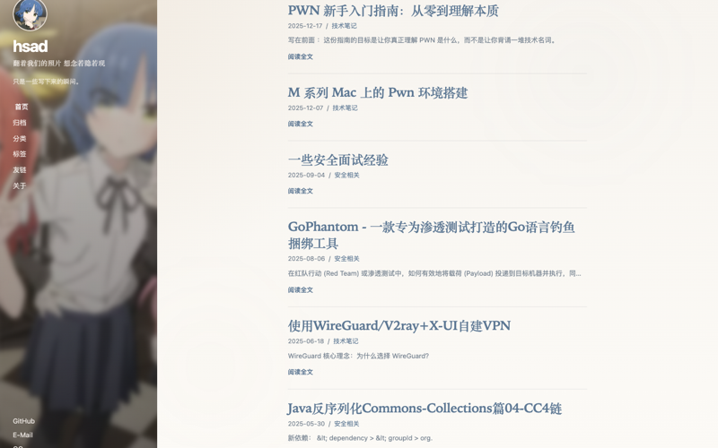

# hexo-theme-hsad

一个偏安静、偏耐看的 Hexo 主题：左侧是固定视觉侧栏，右侧把文章、归档、分类和标签收得干净一点，适合写技术笔记、学习记录、日常随笔，也适合那种“不想太花，但希望有一点气质”的博客。

在线预览：[hsad.xyz](https://hsad.xyz)



> 这份说明按当前仓库代码整理。  
> 换句话说，它写的不是“理论上的配置项”，而是“这版主题现在真的会怎么表现”。

## 这份文档适合谁

- 第一次把 `hexo-theme-hsad` 装进 Hexo 站点的人
- 已经能跑起来，但想知道每个配置到底影响哪里的用户
- 想继续二次开发、调整风格或整理自己博客主题的人

## 主题的整体气质

- 左侧固定侧栏：适合头像、背景图、站点名、简短副标题
- 首页卡片偏克制：重点是标题、时间、分类和一句摘要
- 文章页更沉一点：有阅读进度、目录、代码块复制、图片题注
- 归档 / 分类 / 标签页都比较清爽，适合长期写作后慢慢堆内容
- 移动端是抽屉式导航，不会把整个页面挤得太碎

## 配置地图

这个主题主要会接触两个配置文件：

| 文件 | 作用 | 你通常改什么 |
| --- | --- | --- |
| 站点根目录 `_config.yml` | 整个 Hexo 站点的基础设置 | 标题、作者、站点地址、永久链接、主题名、部署方式 |
| `themes/hsad/_config.yml` | 主题自己的外观和文案设置 | 头像、侧栏背景、导航、社交链接、页脚文案、赞助信息 |

如果你只记一件事，请记这个：

> 站点是谁、地址是什么、怎么部署，看根目录 `_config.yml`；  
> 主题长什么样、左边写什么字、菜单放什么链接，看 `themes/hsad/_config.yml`。

## 一分钟装起来

### 1. 安装主题

在你的 Hexo 站点目录里执行：

```bash
git clone https://github.com/watanabe-hsad/hexo-theme-hsad.git themes/hsad
```

如果你还没有安装 `hexo-render-pug`，建议一并装上：

```bash
npm install hexo-render-pug
```

### 2. 启用主题

打开站点根目录 `_config.yml`，把主题切到 `hsad`：

```yml
theme: hsad
```

### 3. 生成一次看看

```bash
npx hexo clean
npx hexo generate
```

如果你想本地预览：

```bash
npx hexo server
```

## 推荐的站点级配置

下面这些不是“必须一模一样”，但按这个方向配，和主题的默认气质最搭：

```yml
title: Your Blog
subtitle: '一句副标题'
description: '这里写站点简介'
keywords: 技术, 生活, 随笔
author: Your Name
language: zh-CN
timezone: Asia/Shanghai

url: https://example.com
permalink: :year/:month/:day/:title/

theme: hsad

post_asset_folder: true
syntax_highlighter: prismjs

highlight:
  enable: false

prismjs:
  enable: true
  preprocess: true
  line_number: false
  tab_replace: ''
```

### 为什么推荐这些选项

- `language: zh-CN`：模板里的默认文案是中文，配起来最自然
- `post_asset_folder: true`：文章配图时会省心很多
- `prismjs`：这版主题对代码块的样式和语言标签更适配 Prism
- `permalink`：现在这个主题更适合偏“归档型博客”的链接风格

## 主题配置：先给你一份能直接改的模板

下面是一份更适合分享给别人使用的通用示例。你可以直接拿这份当起点改。

```yml
avatar: /images/avatar.jpg
sidebar_background: /images/background.png

accent_color: '#496b8c'
accent_soft: '#dce8f0'

brand_name: hsad
brand_subtitle: 写一点留给夜里的话
sidebar_note: 用很少的话介绍自己，剩下的交给文章。

excerpt_length: 56

menu:
  - name: 首页
    path: /
  - name: 归档
    path: /archives/
  - name: 分类
    path: /categories/
  - name: 标签
    path: /tags/
  - name: 友链
    path: /links/
  - name: 关于
    path: /about/

social:
  - name: GitHub
    url: https://github.com/yourname
  - name: E-Mail
    url: mailto:you@example.com

footer:
  text: 写下想留下的，再让时间替你排好顺序。
  support:
    enable: false
    title: Your Sponsor
    link: https://example.com/
    logo: ''
    prefix: Supported by
    suffix: ''
  license_name: CC BY-NC 4.0
  license_url: https://creativecommons.org/licenses/by-nc/4.0/deed.zh-hans
```

## 主题配置字段详解

### 基础视觉

| 字段 | 类型 | 作用 | 建议 |
| --- | --- | --- | --- |
| `avatar` | 字符串 | 侧栏头像、移动端顶部头像 | 推荐放在站点 `source/images/` 下，然后写成 `/images/xxx.jpg` |
| `sidebar_background` | 字符串 | 左侧整块背景图 | 选一张纵向裁切也好看的图，效果会很稳 |
| `accent_color` | 字符串 | 主题强调色，会影响阅读进度条和局部强调色 | 推荐低饱和蓝、灰蓝、灰绿这类耐看颜色 |
| `accent_soft` | 字符串 | 主题柔和辅助色，会影响局部氛围色 | 推荐比主色更浅、更雾一点 |

### 文案

| 字段 | 类型 | 作用 | 建议 |
| --- | --- | --- | --- |
| `brand_name` | 字符串 | 站点主标题 | 尽量短，1 到 12 个字符最舒服 |
| `brand_subtitle` | 字符串 | 站点副标题 | 一句你想让别人先看到的话 |
| `sidebar_note` | 字符串 | 头像下面那段说明 | 适合写一句简介，不宜太长 |

### 列表与导航

| 字段 | 类型 | 作用 | 建议 |
| --- | --- | --- | --- |
| `excerpt_length` | 数字 | 首页摘要的最长截取长度 | 中文博客建议 48 到 80 |
| `menu` | 数组 | 左侧导航菜单 | 内链用 `/path/`，外链直接写完整 `https://...` |
| `social` | 数组 | 左侧社交链接 | 名字会原样显示，建议简洁 |

### 页脚

| 字段 | 类型 | 作用 | 建议 |
| --- | --- | --- | --- |
| `footer.text` | 字符串 | 页脚主文案 | 一句收尾的话 |
| `footer.support.enable` | 布尔值 | 是否显示赞助信息 | 没有就关掉 |
| `footer.support.title` | 字符串 | 赞助方名称 | 例如品牌名、朋友名、服务商名 |
| `footer.support.link` | 字符串 | 赞助方链接 | 建议写完整 URL |
| `footer.support.logo` | 字符串 | 赞助方 logo | 可以为空 |
| `footer.support.prefix` | 字符串 | 赞助文案前缀 | 例如“本网站由” |
| `footer.support.suffix` | 字符串 | 赞助文案后缀 | 例如“提供支持” |
| `footer.license_name` | 字符串 | 版权协议名称 | 例如 `CC BY-NC 4.0` |
| `footer.license_url` | 字符串 | 版权协议地址 | 建议填官方链接 |

> 当前模板已经兼容旧写法：  
> 如果你之前把 `license_name`、`license_url` 写在配置顶层，也能继续显示。  
> 但后续更推荐统一写进 `footer` 下面，更清楚一点。

### 一个容易困惑的字段：`hero`

`themes/hsad/_config.yml` 里你会看到一个 `hero` 字段组，但当前这版首页模板并没有真正启用它。

也就是说：

- 它现在更像预留位
- 你可以先保留，不影响使用
- 如果后面你想扩展首页 Hero 区，再把它接进模板就行

为了避免误会，这份文档不会把它当成“当前可见功能”来介绍。

## 页面怎么建

这个主题建议至少准备下面几个页面。

### 1. 分类页

文件：`source/categories/index.md`

```md
---
layout: categories
title: 分类
type: categories
comments: false
---
```

### 2. 标签页

文件：`source/tags/index.md`

```md
---
layout: tags
title: 标签
type: tags
comments: false
---
```

### 3. 关于页

文件：`source/about/index.md`

```md
---
title: 关于
date: 2026-05-12 20:00:00
---

这里写你自己。

可以是技术方向、兴趣爱好、博客想写什么，也可以只是几句很轻的自我介绍。
```

### 4. 友链页

文件：`source/links/index.md`

```md
---
layout: links
title: 我的小伙伴们
description: 一些很喜欢的站点和朋友。
links:
  - url: https://example.com
    avatar: https://example.com/avatar.png
    name: Example
    blog: Example Blog
    desc: 这里写一句介绍
  - url: https://another-example.com
    avatar: https://another-example.com/avatar.jpg
    name: Another
    blog: Another Blog
    desc: 再写一句介绍
---

如果你想在友链列表上方多写一点说明，也可以直接写在这里。
```

友链页会读取这几个字段：

| 字段 | 是否必须 | 说明 |
| --- | --- | --- |
| `url` | 是 | 友链地址 |
| `avatar` | 否 | 头像 |
| `name` | 建议 | 人名或昵称 |
| `blog` | 否 | 博客名称 |
| `desc` | 否 | 一句描述 |

### 5. 404 页面

文件：`source/404.md`

```md
---
layout: 404
title: 页面走丢了
permalink: /404.html
---
```

## 文章怎么写，效果会更好

这部分很关键，因为这个主题有一些“写法会直接影响观感”的行为。

### 1. 想让首页摘要更自然，最好手动写 `description`

首页文章卡片的摘要读取逻辑大致是：

1. 先读 `post.description`
2. 没有的话，再尝试 `post.excerpt`
3. 还没有，再从正文里自动抽一句

而且当前版本已经额外做了几层过滤：

- 会尽量跳过代码块
- 会尽量跳过表格
- 会尽量跳过图片和 figure
- 会避开一些像依赖清单、XML、SQL、payload 这类不适合做摘要的内容

所以最稳的写法是：

```md
---
title: 一篇文章
date: 2026-05-12 20:10:00
categories:
  - Hexo
tags:
  - Theme
description: 这一句会直接出现在首页文章卡片里，最可控，也最好看。
---
```

### 2. 想让文章目录出现，至少要有 `##` 标题

当前文章页的目录规则是：

- 检测正文里是否存在 `h2` 到 `h4`
- 移动端目录显示到三级标题
- 桌面端侧边目录收敛到二级标题，阅读时更干净

如果你整篇文章只有一级标题，目录就不会出现。

推荐写法：

```md
## 环境准备

### 安装依赖

## 漏洞原理

## 复现过程
```

### 3. 代码块最好带语言名

这版主题会自动给文章里的代码块套一层“代码框”，包括：

- 顶部语言标签
- 复制按钮
- 复制成功状态

所以你最好这样写：

<pre lang="md"><code>```python
print("hello")
```</code></pre>

而不是只写无语言的围栏代码块。

### 4. 图片可以自动生成题注

如果一张图片是“独立成段”的，主题会尝试把它包装成带编号的 `figure`，例如：

- `图 01`
- `图 02 · 这是图片说明`

触发条件大致是：

- 图片单独放一行
- 图片不和大段正文混在同一个段落里
- `title` 或 `alt` 里有合理文字

例如：

```md


```

### 5. 分类和标签值得认真写

因为这个主题的分类页、标签页和归档页都比较克制，信息密度主要靠你的内容组织来撑。

如果你愿意在每篇文章里认真维护：

- `categories`
- `tags`
- `description`

那整个站的可读性会明显好一截。

## 资源文件放哪里

最省心的做法，是把头像、背景图、favicon 这类资源放在站点自己的 `source/` 里，而不是直接写死在主题内部。

例如：

```text
source/
├── images/
│   ├── avatar.jpg
│   └── background.png
└── favicon.ico
```

然后在主题配置里这样引用：

```yml
avatar: /images/avatar.jpg
sidebar_background: /images/background.png
```

这样做的好处是：

- 换图时不需要改主题源码
- 以后升级主题时更不容易互相覆盖
- 同一路径也可以被你的站点资源直接接管

## 当前这版主题已经内置的细节

为了方便你以后介绍这个主题，我把“已经做好的体验点”单独列一下：

- 文章页顶部阅读进度条
- 移动端抽屉导航
- 自动高亮当前阅读到的目录项
- 首页更聪明的摘要提取
- 代码块语言头和复制按钮
- 独立图片自动编号与题注
- 桌面端目录高度限制，长目录不会一口气冲出屏幕
- 移动端首页卡片字号和摘要节奏做过收紧

## 这版主题没有内置的东西

这部分提前说清楚，别人用起来会更省心。

- 没有内置搜索框 UI
- 没有内置评论系统 UI
- 没有内置暗黑模式切换
- `hero` 配置目前是预留，不是启用状态

如果你后面想加：

- 搜索：可以接 Hexo 搜索插件，再补一个模板入口
- 评论：可以自己接 Waline / Twikoo / Valine
- 暗黑模式：在 `source/css/hsad-theme.css` 和 `source/js/hsad-theme.js` 基础上扩展很方便

## 常见问题

### 首页摘要还是不理想怎么办

最直接的方法就是给文章写 `description`。  
如果一篇是代码、题解、配置清单特别多的技术文，手写摘要几乎总是更稳。

### 我改了菜单，但高亮不对

这个主题会根据路径前缀判断当前菜单是否激活。  
所以内链最好统一写成：

```yml
path: /tags/
path: /categories/
path: /about/
```

尽量不要混用：

```yml
path: tags
path: /tags
path: /tags/
```

统一成带首尾斜杠的写法最省事。

### 友链页没有显示内容

先检查三件事：

1. `layout` 是否写成了 `links`
2. `links:` 是否真的是 YAML 数组
3. 缩进有没有写错

### 图片没有变成题注样式

大概率是因为图片没有独立成段，或者 `alt/title` 为空。  
把图片单独放一行，基本就对了。

### 目录没有出现

先看正文里有没有 `##` / `###`。  
如果文章结构非常平，目录就不会生成。

### 颜色改了但感觉变化不大

当前 `accent_color` 和 `accent_soft` 主要影响的是：

- 阅读进度条
- 局部强调色
- 页面氛围光晕

如果你想整站彻底换肤，还是要继续改：

- `source/css/hsad-theme.css`

## 二次修改时先看哪里

如果你准备继续折腾这个主题，建议按这个顺序找文件：

| 目标 | 文件 |
| --- | --- |
| 改导航、文案、页脚、头像、背景 | `themes/hsad/_config.yml` |
| 改整体颜色、间距、字号、卡片样式 | `themes/hsad/source/css/hsad-theme.css` |
| 改抽屉、目录高亮、代码复制、图片题注 | `themes/hsad/source/js/hsad-theme.js` |
| 改页面结构 | `themes/hsad/layout/` |
| 改文章列表卡片摘要逻辑 | `themes/hsad/layout/_partial/post-list.pug` |
| 改文章页目录和上下篇 | `themes/hsad/layout/post.pug` |

## 最后

这个主题不走“功能堆很多”的路子，它更像一个安静的写作壳子。  
如果你想要的是一份能长期写、长期看、而且不容易看腻的博客主题，它是合适的起点。
